# Laravel ToDo Application

## Overview

The Laravel ToDo Application is a user-friendly task management tool built using the Laravel framework. It enables users to efficiently create, manage, and track their daily tasks. With features such as user authentication, task categorization, reminders, and search functionality, this application is designed to enhance productivity and organization.

## Features

- **User Registration and Authentication**: Securely register and log in users.
- **Google Sign-In**: Seamlessly sign in using Google accounts through Laravel Socialite.
- **Task Management**: Create, edit, delete, and mark tasks as completed with ease.
- **Task Categorization and Filtering**: Organize tasks into categories for better management and filtering.
- **Task Search**: Quickly find tasks with an intuitive search feature.
- **Task Priority and Due Date Management**: Set priority levels and due dates to manage tasks effectively.
- **Email Reminders**: Receive email notifications for upcoming tasks based on specified reminder times.
- **Responsive Design**: Access the application on both desktop and mobile devices.
- **User Profile Management**:
  - Edit profile information, including personal details and profile images.
  - Upload, delete, or change the profile image effortlessly.
  - Securely change the password for enhanced account security.
  - View user-related data statistics in a visually appealing format.

## Requirements

- PHP 8.0 or higher
- Laravel 9 or higher
- MySQL
- Composer

## Installation

### Step 1: Clone the Repository

```bash
git clone https://github.com/mahmoudkhairy159/Laravel_TO_Do_Application.git
cd Laravel_TO_Do_Application
```

### Step 2: Install PHP Dependencies

```bash
composer install
```

### Step 3: Setup Environment Variables

1. Create a `.env` file in the root directory by copying the content from `.env.example`:

   ```bash
   cp .env.example .env
   ```

2. Update the following environment variables in the `.env` file:

   ```env
   DB_CONNECTION=mysql
   DB_HOST=127.0.0.1
   DB_PORT=3306
   DB_DATABASE=todo_app
   DB_USERNAME=root
   DB_PASSWORD=your_database_password

   MAIL_MAILER=smtp
   MAIL_HOST=smtp.mailtrap.io
   MAIL_PORT=2525
   MAIL_USERNAME=your_mailtrap_username
   MAIL_PASSWORD=your_mailtrap_password
   MAIL_ENCRYPTION=null
   MAIL_FROM_ADDRESS="noreply@todoapp.com"
   MAIL_FROM_NAME="${APP_NAME}"
   ```

### Step 4: Generate Application Key

```bash
php artisan key:generate
```

### Step 5: Run Migrations and Seed Database

```bash
php artisan migrate --seed
```

### Step 6: Serve the Application

```bash
php artisan serve
```
## Usage

After completing the installation steps, you can access the application by navigating to `http://localhost:8000` in your web browser. Create an account, log in, and start managing your tasks effectively!
## Ask a question.
If you have any queries please contact at mahmoudkhairy159@gmail.com

## Screenshot

### Login
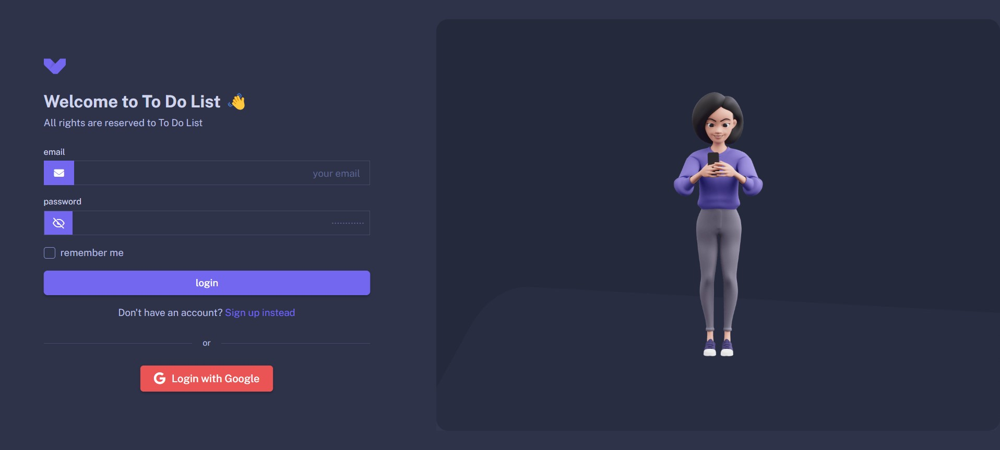
### Sign-up
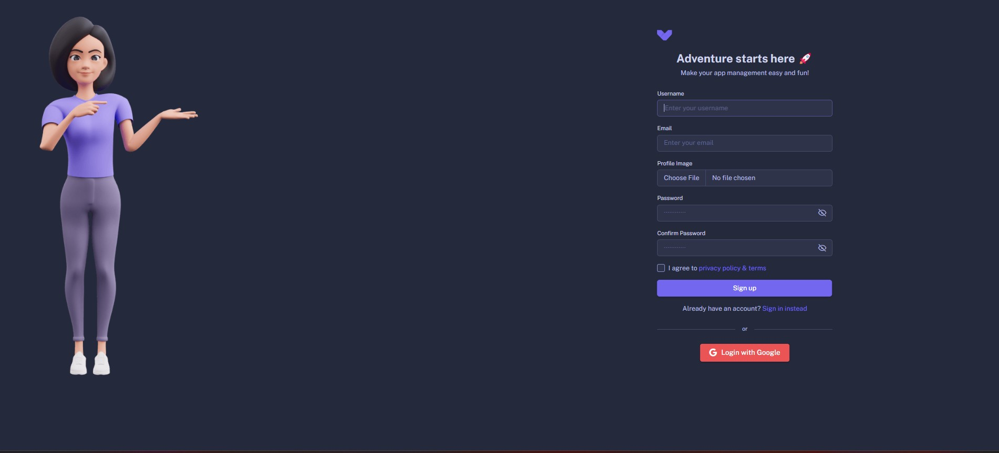
### Login-with-google
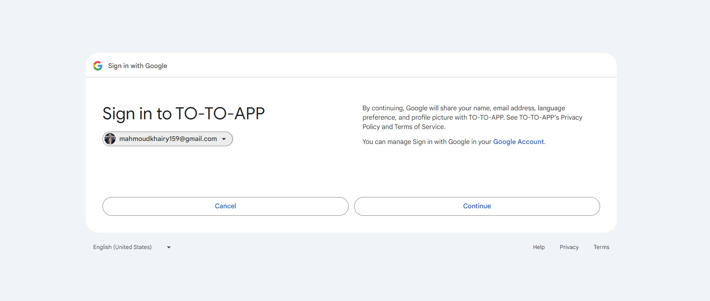
### Dashboard
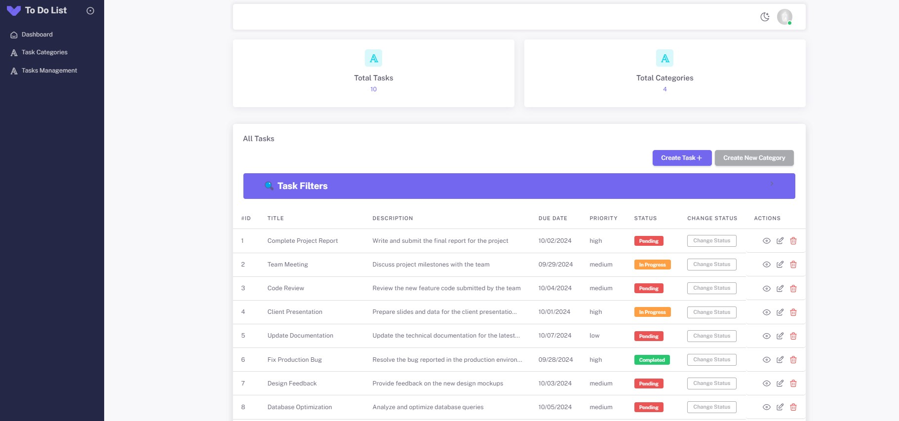
### Task Filtration
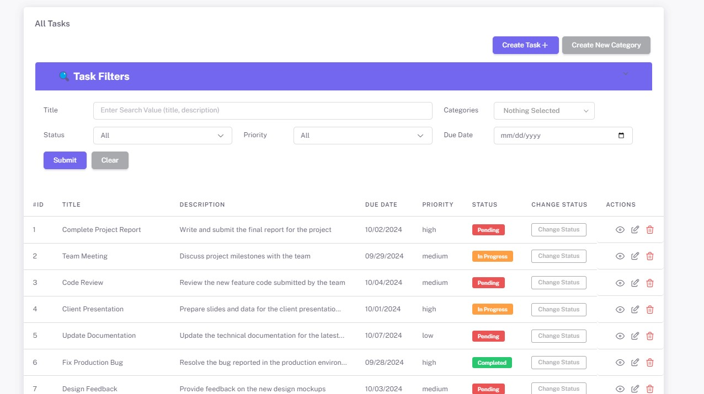
### Task-categories
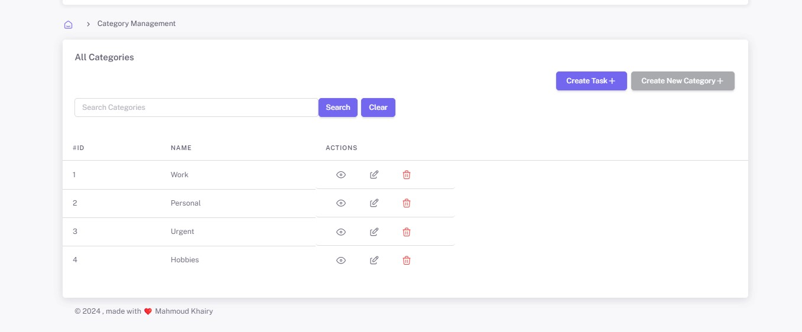
### Create-category
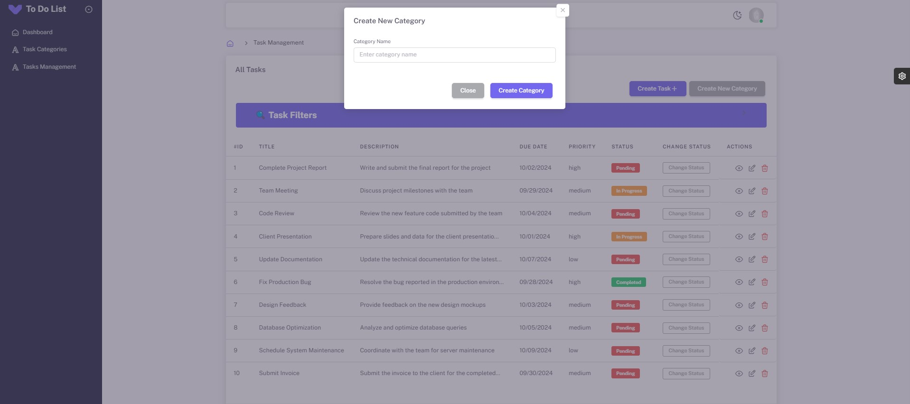
### Create-task
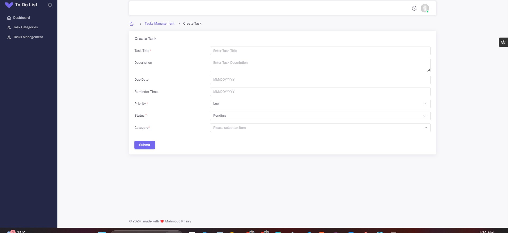
### Edit-task
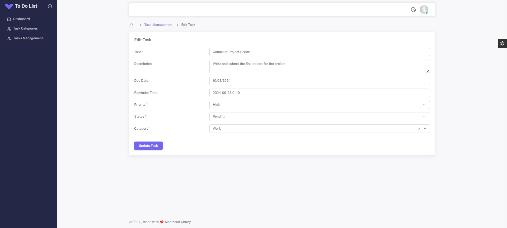
### Show-category-with-related-tasks
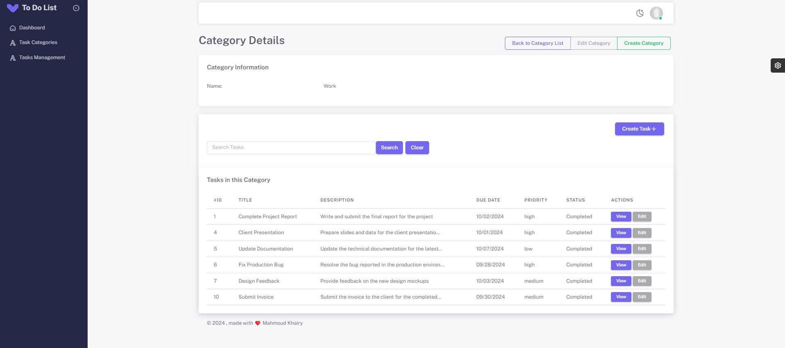
### Profile-page
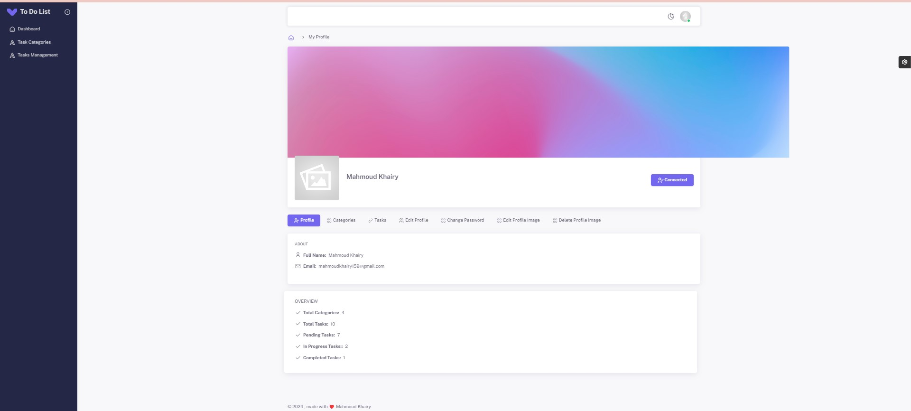
### Edit-profile
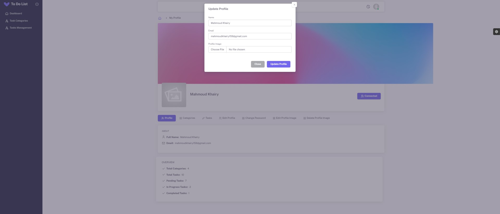
### Change-password
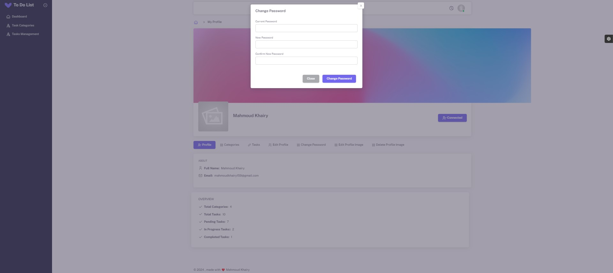
### Edit-profile-image 

### Delete-profile-image
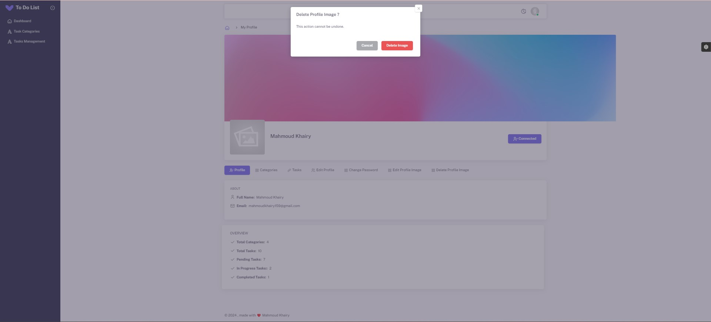
### Receive email notifications for upcoming tasks based on specified reminder times.
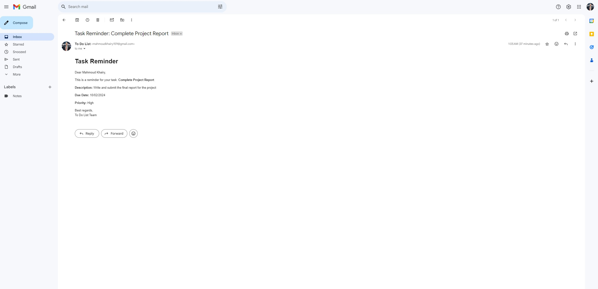

